<div align="center">



<br>


<br>

`TI • Desenvolvimento Web • Cibersegurança`

</div>

## sobre mim

Eu gosto de pegar uma ideia ainda crua e transformar em produto.

Trabalho com **desenvolvimento web, aplicações mobile, APIs, inteligência artificial e cibersegurança**, passando por front-end, back-end, autenticação, banco de dados, infraestrutura e experiência de usuário.

Grande parte do que aprendo vem construindo meus próprios produtos: penso, desenvolvo, testo, quebro, corrijo e continuo melhorando.

## produtos

<table>
<tr>
<td width="50%" valign="top">

### Nivo AI

**Uma IA para pensar, criar, estudar e resolver.**

O Nivo foi criado para juntar em uma única experiência recursos que normalmente ficam espalhados em várias ferramentas.

Ele conversa, pesquisa, ajuda a estudar, programa, trabalha com arquivos e imagens, usa memória por conta e organiza projetos sem transformar a interface em um painel cheio de controles.

O foco é simples: **abrir, perguntar e continuar trabalhando.**

**Principais recursos**
- chat com IA em tempo real
- voz
- geração e análise de imagens
- arquivos e anexos
- pesquisa na web
- memória e preferências
- projetos e histórico
- diferentes níveis de raciocínio
- API própria
- experiência mobile e desktop

<p>
<a href="https://nivoai.sbs"></a>
<a href="https://github.com/dn-dev7/nivostudy"></a>
</p>

</td>
<td width="50%" valign="top">

### Hydra Agro

**Tecnologia para organizar a rotina no campo.**

O Hydra Agro reúne informações da propriedade em um só lugar para facilitar o acompanhamento de animais, água, clima, atividades, setores e registros do dia a dia.

O projeto também explora identificação por **NFC/RFID**, recursos offline, relatórios, IA especializada e ferramentas pensadas para uso simples em propriedades rurais.

**Principais recursos**
- gestão de animais e rebanho
- água e clima
- setores e atividades
- identificação NFC/RFID
- ocorrências e monitoramento
- relatórios e planilhas
- IA para dados da propriedade
- experiência web e mobile

<p>
<a href="https://www.hydraagro.sbs/"></a>
<a href="https://github.com/dn-dev7/hydra-agro"></a>
</p>

</td>
</tr>
</table>

## destaque — Nivo AI

O Nivo é o projeto onde concentro meu trabalho com **produto, IA e experiência de uso**.

A proposta não é ser apenas mais um chat. O produto foi pensado para reduzir atrito: menos telas desnecessárias, menos configurações aparecendo o tempo todo e mais foco na conversa e no que a pessoa está tentando fazer.

A aplicação inclui autenticação própria por código, memória persistente, controle de uso, projetos, pesquisa, voz, geração de imagem e uma camada própria de API para organizar os recursos de inteligência artificial.

O desenvolvimento continua ativo, com foco em tornar o Nivo mais rápido, simples e completo sem perder a identidade do produto.

<div align="center">

### nivoai.

**pergunte. crie. resolva. continue.**

<a href="https://nivoai.sbs">
  
</a>

</div>

## áreas

```text
TI
├── Desenvolvimento Web
├── Full-Stack
├── Front-End
├── APIs
├── Inteligência Artificial
├── Cibersegurança
├── Aplicações Mobile
├── UI/UX
├── PWA
└── Infraestrutura
```

## stack

<div align="center">


</div>

<br>

## atividade

<div align="center">

<picture>
  <source media="(prefers-color-scheme: dark)" srcset="https://raw.githubusercontent.com/dn-dev7/dn-dev7/output/github-contribution-grid-snake-dark.svg">
  <source media="(prefers-color-scheme: light)" srcset="https://raw.githubusercontent.com/dn-dev7/dn-dev7/output/github-contribution-grid-snake.svg">
  
</picture>

</div>

<br>

<div align="center">

`build > test > break > improve > repeat`

</div>
